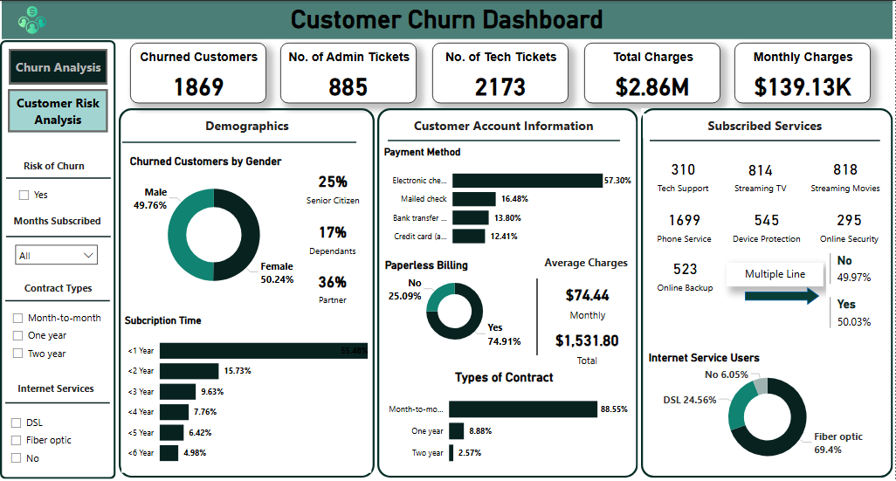
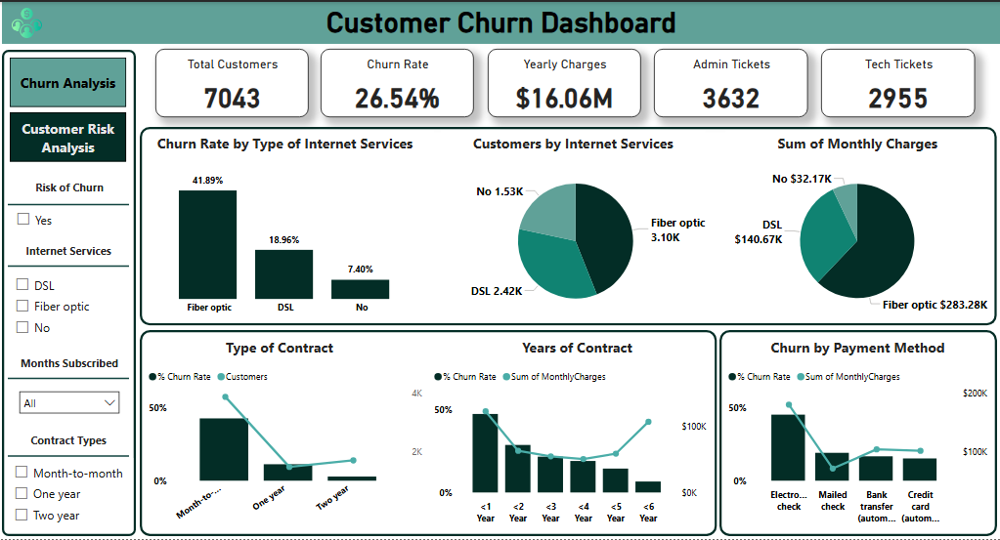

# Customer Churn Analysis  

*Tool Used:* Power BI  
*Domain:* Telecom / Customer Retention  

---

## Problem Statement  
Telecom companies often face high customer churn rates, leading to significant revenue losses.  
The goal of this project was to *analyze customer data to identify churn drivers* and provide insights for improving retention strategies.  

---

## Data  
- Dataset: Telecom customer records (synthetic dataset used for training/analysis).  
- Key variables: Customer demographics, services subscribed, billing information, tenure, contract type, churn flag.  

---

## Method  
- Imported and cleaned dataset in Power BI.  
- Built *calculated measures* to track churn-related KPIs.  
- Created *interactive dashboards* for exploring churn by demographics, tenure, and billing patterns.  

---

## Key Findings  
- *High churn* observed among month-to-month contract customers.  
- Customers with higher monthly charges showed greater likelihood of churn.  
- Senior citizens had a higher churn rate compared to younger age groups.  

---

## Recommendations  
- Promote longer-term contracts with incentives.  
- Offer tailored discounts to high-spending customers at risk.  
- Improve onboarding experience for senior citizens.  

---

## Dashboard Preview  

**Churn Overview Dashboard**
 

**Churn Drilldown Dashboard**
  

---

## Contact  
For dataset or additional details, please reach out at virginia.ezemaduakor@gmail.com
