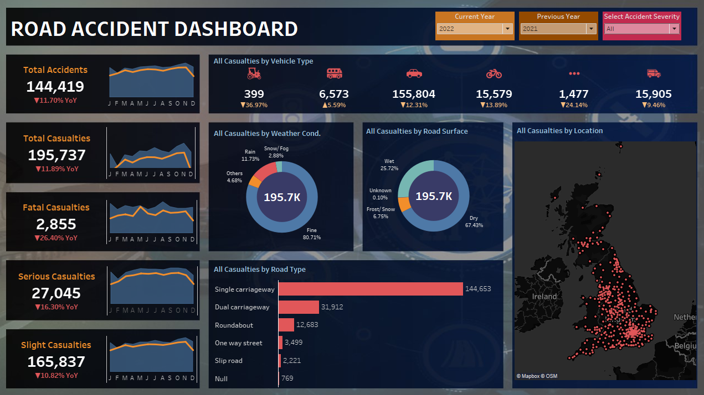

# Road Accident Analysis

**Tools Used:** Tableau Desktop  
**Domain:** Traffic Safety / Casualty Analytics

---

## Project Overview  
Road traffic accidents remain a critical global issue, causing over 1.35 million deaths annually and tens of millions of non-fatal injuries. This project uses accident data to identify casualty trends and contributing factors, supporting more informed road safety policies.

### Objective  
Analyze key patterns in accident severity, contributing conditions (vehicle type, road type, weather), and geographic hotspots to inform interventions that reduce injuries and fatalities.

---

## KPI Analysis  
- **Fatal casualties:** 2,855 — a 26% decrease YoY  
- **Serious casualties:** 27,045 — a 16% decrease YoY  
- **Slight casualties:** 165,837 — a 10% decrease YoY  

---

## Key Findings  
- **Total accidents:** 144,419  
- **Total casualties:** 195,737 (11% overall reduction YoY)  
- **Vehicle type:** Cars account for the highest casualty count.  
- **Weather conditions:** ~80% of casualties occurred during "Fine" weather — suggesting worse weather leads to more cautious driving.  
- **Road surface:** Dry roads involved in ~67% of casualties; wet or icy roads had fewer incidents.  
- **Road type:** Single carriageways accounted for over 73% of casualties — higher risk compared to dual carriageways.  
- **Location:** The highest casualty count occurred in Barnet.

---

## Recommendations  
- **Infrastructure upgrades:** Focus on safer road design—pedestrian paths, improved lighting, and smoother surfaces. Consider upgrading single carriageways.  
- **Law enforcement:** Strengthen speed control, DUI checkpoints, and helmet/seatbelt enforcement.  
- **Public awareness:** Run targeted safety campaigns in communities, schools, and through media to encourage safer driving behavior.

---

## Conclusion  
Accident-related casualties are preventable. With strategic improvements to infrastructure, enforcement policies, and public awareness, road safety outcomes can be significantly enhanced.

---

## Dashboard & Visuals  
Visuals created in Tableau includes:  
- Accident severity trends  
- Vehicle type breakdown  
- Weather and surface condition analysis  
- Road type and location trends  

Click to view accident severity trends for: 
[Fatal Casualties](./image/All.png)
[Serious Casualties](./image/All.png)
[Slight Casualties](./image/All.png)

---

## Files in Repository  
- README.md – This project documentation  
- images/ – Tableau dashboard screenshots and charts
